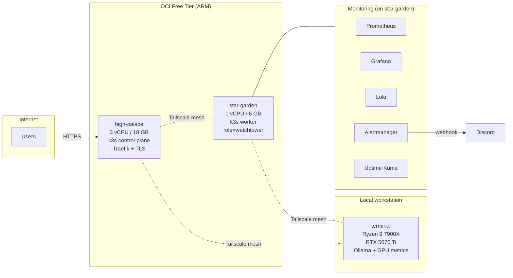

# homelab

Multi-node k3s homelab on Oracle Cloud Free Tier (ARM) with a Windows GPU node joined over Tailscale. Demonstrates IaC, observability, secure ingress, and backup discipline at small scale.

## Architecture



- **Ingress**: Traefik on `high-palace`, auto-TLS via Let's Encrypt.
- **Mesh**: Tailscale WireGuard across all three nodes. No public SSH.
- **Storage**: local-path-provisioner. Persistent volumes pinned to the node they were provisioned on.
- **GitOps**: manifests in this repo are applied with `kubectl apply -f`. Flux is on the roadmap (see below).

## Tech Stack

| Layer | Tool |
|---|---|
| Cloud / IaC | Oracle Cloud Infrastructure, Terraform |
| OS | Oracle Linux 9 (aarch64), Windows 11 |
| Orchestration | k3s v1.34 |
| Mesh / overlay | Tailscale, flannel VXLAN |
| Ingress / TLS | Traefik v2, Let's Encrypt (ACME HTTP-01) |
| Metrics | Prometheus, node-exporter, windows_exporter, nvidia_gpu_exporter, kube-state-metrics |
| Logs | Loki + Promtail |
| Alerting | Alertmanager → Discord |
| Uptime | Uptime Kuma |
| Secrets | Sealed Secrets (bitnami-labs) |
| CI | GitHub Actions (kubeconform + `terraform validate`) |

## Hosted workloads

- **[chronicle](https://github.com/GRANTUR/chronicle)** — FastAPI + Discord bot calendar assistant, deployed in the `ecosystem` namespace.
- Private self-hosted services (game server, custom plugins) that live outside this repo.

## What's in this repo

```
homelab/
├── terraform/              # OCI infrastructure (VCN, subnets, security lists, ARM compute)
├── platform/               # Traefik HelmChartConfig + example IngressRoutes
├── monitoring/             # Prometheus, Grafana, Alertmanager, node-exporter
└── .github/workflows/      # validate.yml — kubeconform + terraform fmt/validate
```

Terraform state and `terraform.tfvars` are gitignored. The monitoring and platform manifests here are sanitized — real secrets (Grafana admin password, Discord webhook, basic-auth hashes) are supplied via Kubernetes secrets or Sealed Secrets, not committed.

## Why this exists

I'm a bank teller at JPMorgan Chase teaching myself SRE. A homelab forces the skills I actually care about: provisioning from nothing, owning the whole stack end to end, debugging real networking problems instead of simulated ones. Running it on OCI Free Tier means I can't hide behind managed services — every piece is here because I built it.

## Currently exploring

- **FluxCD** — pull-based GitOps to replace `kubectl apply` loops.
- **SLO dashboards** — error budgets and burn-rate alerts over the existing Prometheus data.
- **Terraform remote state** — OCI Object Storage backend with state locking.

## Validate locally

```bash
# Terraform
cd terraform && terraform fmt -check -recursive && terraform validate

# Kubernetes manifests
kubeconform -strict -summary monitoring/ platform/
```
